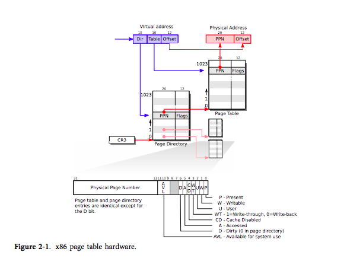
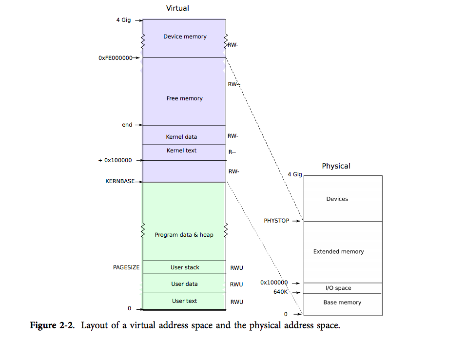

[参照：29p](https://pdos.csail.mit.edu/6.828/2014/xv6/book-rev8.pdf)

# Page Table

## Page Tables

> Page tables are the mechanism through which the operating system controls what
memory addresses mean. They allow xv6 to multiplex the address spaces of different
processes onto a single physical memory, and to protect the memories of different processes.
The level of indirection provided by page tables is also a source for many neat
tricks. xv6 uses page tables primarily to multiplex address spaces and to protect memory.
It also uses a few simple page-table tricks: mapping the same memory (the kernel)
in several address spaces, mapping the same memory more than once in one address
space (each user page is also mapped into the kernel’s physical view of memory),
and guarding a user stack with an unmapped page. The rest of this chapter explains
the page tables that the x86 hardware provides and how xv6 uses them.

ページテーブルはメモリアドレスが何を意味するかをコントロールするOSの機能である。ページテーブルはxv6が異なるプロセスのアドレス空間を一つの物理メモリ空間に複数配置できるようにしていて、異なるプロセスのメモリを守っている。ページテーブルの提供する間接的なアドレスの参照は不思議なことが多い。xv6の使うページテーブルは主に複数のアドレス空間とメモリ保護を目的にしている。xv６はシンプルなページテーブルの処理を行っている。同じメモリをいくつかのアドレス空間にマッピングしたり（カーネル）、同じメモリを一つのアドレス空間にマッピングしたり（各ユーザーページはカーネルの物理メモリテーブルにマッピングされている）、そしてユーザースタックがマッピングされていないページに伸びないように防いでいる。この賞の残りはx86ハードが提供するページテーブルについて説明し、どのようにxv6がページて０ブルを利用しているかを説明する。

## Paging hardware

> As a reminder, x86 instructions (both user and kernel) manipulate virtual addresses.
The machine’s RAM, or physical memory, is indexed with physical addresses. The x86
page table hardware connects these two kinds of addresses, by mapping each virtual
address to a physical address.
An x86 page table is logically an array of 2^20 (1,048,576) page table entries
(PTEs). Each PTE contains a 20-bit physical page number (PPN) and some flags. The
paging hardware translates a virtual address by using its top 20 bits to index into the
page table to find a PTE, and replacing the address’s top 20 bits with the PPN in the
PTE. The paging hardware copies the low 12 bits unchanged from the virtual to the
translated physical address. Thus a page table gives the operating system control over
virtual-to-physical address translations at the granularity of aligned chunks of 4096
(2^12) bytes. Such a chunk is called a page.
As shown in Figure 2-1, the actual translation happens in two steps. A page table
is stored in physical memory as a two-level tree. The root of the tree is a 4096-byte
page directory that contains 1024 PTE-like references to page table pages. Each
page table page is an array of 1024 32-bit PTEs. The paging hardware uses the top 10
bits of a virtual address to select a page directory entry. If the page directory entry is
present, the paging hardware uses the next 10 bits of the virtual address to select a
PTE from the page table page that the page directory entry refers to. If either the
page directory entry or the PTE is not present, the paging hardware raises a fault.
This two-level structure allows a page table to omit entire page table pages in the common
case in which large ranges of virtual addresses have no mappings.
Each PTE contains flag bits that tell the paging hardware how the associated virtual
address is allowed to be used. PTE_P indicates whether the PTE is present: if it is
not set, a reference to the page causes a fault (i.e. is not allowed). PTE_W controls
whether instructions are allowed to issue writes to the page; if not set, only reads and
instruction fetches are allowed. PTE_U controls whether user programs are allowed to
use the page; if clear, only the kernel is allowed to use the page. Figure 2-1 shows how
it all works. The flags and all other page hardware related structures are defined in
mmu.h (0700).
A few notes about terms. Physical memory refers to storage cells in DRAM. A
byte of physical memory has an address, called a physical address. Instructions use
only virtual addresses, which the paging hardware translates to physical addresses, and
then sends to the DRAM hardware to read or write storage. At this level of discussion
there is no such thing as virtual memory, only virtual addresses.

思い出してみてください。xv6の説明にはユーザーとカーネルのメモリ空間を両方を操るとあります。
RAMまたは物理メモリは物理アドレスによって表現されています。xv6のページテーブルハードウェアはそれらに仮想アドレスを物理アドレスにマッピングすることで二種類のアドレスがあります。x86ページテーブルは論理的に2^20のページテーブルエントリ(PTE)の配列になります。各PTEは２０ビットの物理ページ番号(PPM)といくつかのフラグを持っています。ページングハードウェアは仮想アドレスをPTEの２０ビットを元に変換します。そしてアドレスの上位２０ビットをPPNに置き換えます。ページングハードウェアは下位１２ビットを仮想上から変える事無く変換された物理アドレスにコピーすることができるのです。つまり、ページテーブルはOSに4096byteのチャンクのまとまりとして仮想アドレスから物理アドレスへの変換を提供するのです。そのようなチャンクのことを「ページ」と呼びます。

図の２−１をみてください。実際の変換には二つのステップが含まれていることがわかります。ページテーブルは二段階の木構造として物理アドレスの中に保存されます。木のルートには4096byteのページディレクトリがあり、それにはPTEのような1024のページテーブルのページへの参照が含まれています。
各ページテーブルのページは32ビットのPTEが1024個ある配列となっています。
ページングハードウェアは仮想アドレスの上位10ビットを使いページディレクトリエントリを選択します。もしページディレクトリエントリが存在しているならば、ページングハードウェアは仮想アドレスの次の10ビットを使ってページディレクトリエントリが指し示すページテーブルのページからPTEを選択します。もし、ページディレクトリエントリか、PTEがなければページングハードウェアは失敗したという風になります。この二段階構造はページテーブルに全ページテーブルのページに省略させる（仮想アドレスの大部分がマッピングされていないという一般的な場合において）。
各PTEはフラグ用のビットを持っています。そのビットはページングハードウェアにどのように関連づけられた仮想アドレスが使っていいかを示します。
`PTE_P`はそのPTEが存在するかを示し、もしなければセットされてなく、ページへの参照は失敗するようになっています（てか許可されてない）。
`PTE_W`は命令がページに書き込んでいいかどうかを示します。もしセットされていなければ、読み込みしか許可されてない事になります。`PTE_U`はユーザープログラムがこのページを使っていいかどうかを制御します。もしなければ、カーネルしかそのページを利用することはできないでしょう。
図の２−１には全ての動作が載っています。フラグと全ての他のページハードウェアは`mmu.h`に定義されている構造に関連しています。
もう少し話すと、物理メモリはDRAMの記憶素子を参照しています。物理メモリの１byteは物理アドレスを持っているのです。命令は仮想アドレスのみを利用します。そしてページングハードウェアは物理アドレスへと仮想アドレスを変換するのです。さらに記憶素子に書き込みか読み込みをしているという事になります。

## Process Address space

> The page table created by entry has enough mappings to allow the kernel’s C
code to start running. However, main immediately changes to a new page table by
calling kvmalloc (1857), because kernel has a more elaborate plan for describing process
address spaces.
Each process has a separate page table, and xv6 tells the page table hardware to
switch page tables when xv6 switches between processes. As shown in Figure 2-2, a
process’s user memory starts at virtual address zero and can grow up to KERNBASE, allowing
a process to address up to 2 GB of memory. The file memlayout.h (0200) declares
the constants for xv6’s memory layout, and macros to convert virtual to physical addresses.
When a process asks xv6 for more memory, xv6 first finds free physical pages to
provide the storage, and then adds PTEs to the process’s page table that point to the
new physical pages. xv6 sets the PTE_U, PTE_W, and PTE_P flags in these PTEs. Most
processes do not use the entire user address space; xv6 leaves PTE_P clear in unused
PTEs. Different processes’ page tables translate user addresses to different pages of
physical memory, so that each process has private user memory.
Xv6 includes all mappings needed for the kernel to run in every process’s page table;
these mappings all appear above KERNBASE. It maps virtual addresses KERNBASE:KERNBASE+PHYSTOP
to 0:PHYSTOP. One reason for this mapping is so that the
kernel can use its own instructions and data. Another reason is that the kernel sometimes
needs to be able to write a given page of physical memory, for example when
creating page table pages; having every physical page appear at a predictable virtual
address makes this convenient. A defect of this arrangement is that xv6 cannot make
use of more than 2 GB of physical memory. Some devices that use memory-mapped
I/O appear at physical addresses starting at 0xFE000000, so xv6 page tables including
a direct mapping for them. Xv6 does not set the PTE_U flag in the PTEs above KERNBASE,
so only the kernel can use them.
Having every process’s page table contain mappings for both user memory and the entire kernel is convenient when switching from user code to kernel code during
system calls and interrupts: such switches do not require page table switches. For the
most part the kernel does not have its own page table; it is almost always borrowing
some process’s page table.
To review, xv6 ensures that each process can only use its own memory, and that
each process sees its memory as having contiguous virtual addresses starting at zero.
xv6 implements the first by setting the PTE_U bit only on PTEs of virtual addresses
that refer to the process’s own memory. It implements the second using the ability of
page tables to translate successive virtual addresses to whatever physical pages happen
to be allocated to the process.

エントリによって作られたページテーブルはカーネルのCコードを動作させるのに十分なマッピングを持っています。しかし、メイン関数は直ちに`kvmalloc`を呼び出す事で新しいページテーブルに変更しています。なぜならカーネルはプロセスを表現するためにより精密な計画をしなければならないからです。各プロセスは別々のページテーブルを持っています。そしてxv6はページテーブルハードウェアにプロセスが変更されるたびにページテーブルを変更するように示します。

図の２−２をみてください。プロセスのユーザーメモリは仮想アドレスの０番地からスタートしています。そしてカーネルベースに向かうように進んでいきます。
プロセスには２ギガまでアドレスを利用しても良い事にしています。`memlayout.h`ではxv6におけるメモリレイアウトが宣言されています。
そしてマクロとして仮想メモリから物理メモリへの変換処理が定義されています。プロセスがxv６にもっとメモリをよこせと頼むと、xv６はまず空いている物理メモリを探します。そして、PTEにプロセス用の見つけた空き物理メモリを指し示すページテーブルを追加して、`PTE_W`と`PTE_P`、`PTE_U`フラグをセットして、おきます。大半のプロセスはユーザーアドレス空間の全てを使うようなことはないですので、使ってないPTEの`PTE_P`はクリアされています。異なるプロセスのページテーブルはユーザーアドレスを物理メモリの異なるページに変換します。なので各プロセスは個別のユーザーメモリを持っておけるのです。xv６はカーネルが全てのプロセスのページにて動作できるようにマッピングをしています。そのマッピングじゃ`KERNBASE`より上位のメモリ位置に行なっています。それは仮想アドレスとして`KERNBASE:KERNBASE+PHYSTOP`を`0:PHYSTOP`にマッピングしています。ひとつ目の理由としてカーネルがカーネル自身の命令とデータを利用できるようにするためです。二つ目の理由にカーネルはたまに与えられた物理メモリのページに書き込む必要があります。例えば、ページテーブルのページを作成するときに、全ての物理ページを予測可能な仮想アドレスにすることはとても便利だからです。この配置の検知はxv６が２ギガ以上の物理メモリを利用できないという事にあります。いくつかのメモリマップIOを利用するデバイスは物理アドレスを`0xFE000000`から始めるようにしています。なのでxv６のページテーブルはそれらに対しては直接マッピングするようにしています。xv６では`KERNBASE`より上位のメモリ番地では`PTE_U`フラグをセットしません。なぜなら、そのメモリ番地はカーネルしか利用しないからです。全てのプロセスのページテーブルはユーザーとカーネルのメモリの両方のマッピングを以ていて、システムコールや割り込みの際にユーザーコードからカーネルコードに切り替えるときに便利です。それはだいたいいつもいくつかのプロセスのページテーブルを借りています。振り返ると、xv６は各プロセスはプロセスの持つメモリだけを利用するようになっていて、各プロセスは持っているメモリを０から始まる仮想アドレスとして持っています。xv６はまず`PTE_U`をセッテイングすることを実装し、`PTE_U`は仮想アドレスをどんな物理ページにも変換できるようにし、プロセスに配置されるようにしています。

## Code: creating an address space

> main calls kvmalloc (1857) to create and switch to a page table with the mappings
above KERNBASE required for the kernel to run. Most of the work happens in setupkvm
(1837). It first allocates a page of memory to hold the page directory. Then it calls
mappages to install the translations that the kernel needs, which are described in the
kmap (1828) array. The translations include the kernel’s instructions and data, physical
memory up to PHYSTOP, and memory ranges which are actually I/O devices. setupkvm
does not install any mappings for the user memory; this will happen later.
mappages (1779) installs mappings into a page table for a range of virtual addresses
to a corresponding range of physical addresses. It does this separately for each virtual
address in the range, at page intervals. For each virtual address to be mapped, mappages
calls walkpgdir to find the address of the PTE for that address. It then initializes
the PTE to hold the relevant physical page number, the desired permissions (
PTE_W and/or PTE_U), and PTE_P to mark the PTE as valid (1791).
walkpgdir (1754) mimics the actions of the x86 paging hardware as it looks up
the PTE for a virtual address (see Figure 2-1). walkpgdir uses the upper 10 bits of
the virtual address to find the page directory entry (1759). If the page directory entry
isn’t present, then the required page table page hasn’t yet been allocated; if the alloc
argument is set, walkpgdir allocates it and puts its physical address in the page directory.
Finally it uses the next 10 bits of the virtual address to find the address of the
PTE in the page table page (1772).

メイン関数は`kvmalloc`をカーネルが実行されるために必要な`KERNBASE`よりっ上位のマッピングを持つページテーブルを作成し、それにスイッチするために呼んでいます。
ほとんどの処理は`setupkvm`ないで行われています。
`setupkvm`はまず、ページディレクトリを固定するためにメモリーのページを配分し、それから、`kmap`配列で説明されている、カーネルが必要な変換をインストールするための`mappage`を呼んでいます。
その変換はカーネルの命令とデータ、`PHYSTOP`までの物理メモリ、デバイスの利用するメモリー範囲を含んでいます。
`setupkvm`はユーザーメモリーのマッピングをインストールすることはしません。あとでやります。
`mappages`はページテーブル用の仮想アドレスの範囲のマッピングをインストールしています。物理アドレスの範囲に対応するためにです。
`mappages`はこの範囲の物理アドレスを各仮想アドレスに分けています。
マッピングされた各仮想アドレスに対して、`mappages`は`walkpgdir`を呼んでいます。`walkpgdir`ではあるアドレスへのPTEをのアドレスを探しています。`walkpgdir`はPTEを関連した物理ページ番号に固定するために初期化しています。そのパーミッション（`PTE_W` とか `PTE_U`）、`PTE_P`をみて、有効かどうか確認してます。`walkpgdir`はx86のページングハードウェアを真似ています。`walkpgdir`は仮想アドレスの上位10ビットを使い、ページディレクトリエントリを探しています。もしページディレクトリエントリが存在しなければ、要求されたページテーブルのページは配置されていないこととなります。
もし`alloc`の引数がセットされていたなら、`walkpgdir`はそれを配置し、ページディレクトリ内の物理アドレスにします。最終的に`walkpgdir`は仮想アドレスの次の10ビットを使い、ページテーブル内のページのPTEのアドレスを探します。

## Physical memory allocation

> The kernel needs to allocate and free physical memory at run-time for page tables,
process user memory, kernel stacks, and pipe buffers.
xv6 uses the physical memory between the end of the kernel and PHYSTOP for
run-time allocation. It allocates and frees whole 4096-byte pages at a time. It keeps
track of which pages are free by threading a linked list through the pages themselves.
Allocation consists of removing a page from the linked list; freeing consists of adding
the freed page to the list.
There is a bootstrap problem: all of physical memory must be mapped in order
for the allocator to initialize the free list, but creating a page table with those mappings involves allocating page-table pages. xv6 solves this problem by using a separate page
allocator during entry, which allocates memory just after the end of the kernel’s data
segment. This allocator does not support freeing and is limited by the 4 MB mapping
in the entrypgdir, but that is sufficient to allocate the first kernel page table.

カーネルはページテーブル、プロセスユーザーメモリ、カーネルスタック、そしてパイプバッファのためにランタイムに物理アドレスの配置と解放を行う必要があります。
xv６はカーネルの終端と`PHYSTOP`の間の物理メモリをランタイムの配備に使っています。xv6は一度に4096byteのページを配備、解放しています。xv6はどのページが解放されているかをページ自体を介して繋がれたリストをスレッド化することによって確認しています。アロケーションはリンクしているリストから削除されたページによって構成されています。ブートストラップログラムがありますね。物理アドレスの全てがアロケーたーがフリーリストを初期化するためにマッピングされています。しかし、ページテーブルのページを配置する関係のマッピングとともにページテーブルは作成されています。xv6はこの問題をエントリーの間はページ分割アロケーターを利用することで解決しています。そしてページ分割アロケータはメモリをカーネルのデータ層の後ろに配備しています。
このアロケータは解放に対応していなく、また`entrypgdir`内にて４MBマッピングによって制限されています。でも、初めのカーネルページテーブルを配備するにはこれで十分なのです。

## Code: Physical memory allocator

> The allocator’s data structure is a free list of physical memory pages that are available
for allocation. Each free page’s list element is a struct run (3014). Where does
the allocator get the memory to hold that data structure? It store each free page’s run
structure in the free page itself, since there’s nothing else stored there. The free list is
protected by a spin lock (3018-3022). The list and the lock are wrapped in a struct to
make clear that the lock protects the fields in the struct. For now, ignore the lock and
the calls to acquire and release; Chapter 4 will examine locking in detail.
The function main calls kinit1 and kinit2 to initialize the allocator (3030). The
reason for having two calls is that for much of main one cannot use locks or memory
above 4 megabytes. The call to kinit1 sets up for lock-less allocation in the first 4
megabytes, and the call to kinit2 enables locking and arranges for more memory to
be allocatable. main ought to determine how much physical memory is available, but
this turns out to be difficult on the x86. Instead it assumes that the machine has 240
megabytes (PHYSTOP) of physical memory, and uses all the memory between the end
of the kernel and PHYSTOP as the initial pool of free memory. kinit1 and kinit2 call
freerange to add memory to the free list via per-page calls to kfree. A PTE can only
refer to a physical address that is aligned on a 4096-byte boundary (is a multiple of
4096), so freerange uses PGROUNDUP to ensure that it frees only aligned physical addresses.
The allocator starts with no memory; these calls to kfree give it some to
manage.
The allocator refers to physical pages by their virtual addresses as mapped in high
memory, not by their physical addresses, which is why kinit uses p2v(PHYSTOP) to
translate PHYSTOP (a physical address) to a virtual address. The allocator sometimes
treats addresses as integers in order to perform arithmetic on them (e.g., traversing all
pages in kinit), and sometimes uses addresses as pointers to read and write memory
(e.g., manipulating the run structure stored in each page); this dual use of addresses is
the main reason that the allocator code is full of C type casts. The other reason is
that freeing and allocation inherently change the type of the memory.
The function kfree (3065) bewgins by setting every byte in the memory being freed
to the value 1. This will cause code that uses memory after freeing it (uses ‘‘dangling
references’’) to read garbage instead of the old valid contents; hopefully that will cause
such code to break faster. Then kfree casts v to a pointer to struct run, records the
old start of the free list in r->next, and sets the free list equal to r. kalloc removes
and returns the first element in the free list.

アロケータのデータ構造はアロケーションが利用可能な物理メモリページのフリーリストです。
各フリーページのリストの要素は`run`ストラクトになっています。
アロケータはどこでメモリにデータ構造を固定させているのでしょうか？メモリは各フリーページの`run`構造体をフリーページ自身に保存しています。なぜなら、そこに保存しなければ保存する場所がないからです。フリーリストはスピンロックによって保護されています。リストとロックは構造体にラップされ、ロックが構造体のフィールドを保護していることを明確にします。
